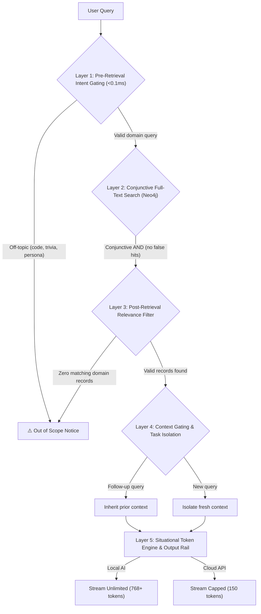

# DPWH Cebu Infrastructure Knowledge Graph & QA System

An end-to-end GraphRAG pipeline for scraping, ingesting, analyzing, and querying **4,370+ DPWH civil works projects** across Cebu Province (2022 – Present).

Built with **Neo4j Aura (Knowledge Graph)**, **Supabase (Document Lake)**, **Apify (Web Scraper)**, and **Local Ollama (`qwen2.5:1.5b`)** for $0-cost, private, sub-second grounded AI question answering with multi-layer domain guardrails.

---

## 🌟 Key Features

* **⚡ Sub-20ms Graph Traversal**: Direct Cypher queries and full-text index lookups across 4,370+ DPWH projects, contractors, budgets, and locations in Cebu.
* **🛡️ 5-Layer Domain Guardrails**: Bulletproof domain lock that intercepts programming questions, generic dictionary definitions, persona overrides (`act as a teacher`), and off-topic queries in `<0.1ms` before hitting Neo4j or the LLM.
* **🔄 Situational Token Engine**:
  * **Local AI (Ollama)**: Automatically detected via `localhost`. Runs with **unlimited output tokens** (`768+` tokens, `num_ctx: 2048`) and zero billing, ensuring responses never cut off mid-sentence.
  * **Cloud APIs (OpenAI / DeepSeek / OpenRouter)**: Strict budget caps (`150` tokens, configurable via `LLM_MAX_TOKENS`) to protect your API balance.
* **⚡ Instant Cypher Mode (Zero AI Needed)**: Full instant lookup cards, analytics, and full-text search run purely on Neo4j Aura in `<10ms`—no local LLM or API keys required.
* **💬 Conversational Memory**: Context-aware follow-ups (e.g. asking *"who is the contractor?"* or *"what was the budget for it?"* after viewing a project).
* **📊 Instant Graph Analytics**: Sub-millisecond aggregation calculates total budget, contractor rankings, project counts, and sector breakdowns directly from graph relationships.

---

## 📁 Repository Structure

```text
Apify/
├── main.py                     # ⚡ Master CLI runner (interactive menu, CLI queries, analytics)
├── pipeline/                   # 📦 Core modular pipeline package
│   ├── __init__.py             # Unified package exports
│   ├── scrape_cebu_dpwh.py     # BetterGov scraper -> Apify & Supabase
│   ├── sync_to_neo4j.py        # Paginated batch ingestion -> Neo4j Aura
│   └── query_graph.py          # Cypher queries, Guardrails, Instant Insights & Ollama LLM
├── .env.example                # Template for required environment variables
├── requirements.txt            # Python dependencies
└── README.md                   # Complete installation, usage & architecture guide
```

---

## 🛠️ Prerequisites

Before installing, ensure you have:

1. **Python 3.10+** (Tested on Python 3.10, 3.11, 3.12, 3.14)
2. **Git**
3. **[Ollama](https://ollama.com/)** (Optional: only needed for local AI natural language summaries)
4. Free Accounts for:
   * **[Neo4j AuraDB](https://neo4j.com/cloud/platform/aura-graph-database/)** (Free cloud graph database instance)
   * **[Supabase](https://supabase.com/)** (Optional: only needed if syncing or scraping)
   * **[Apify](https://apify.com/)** (Optional: only needed if running the scraper)

> [!NOTE]
> All project lookups, contractor rankings, and instant search work **purely with Neo4j**—neither Ollama nor any paid AI API is strictly required to explore the knowledge graph.

---

## 🚀 Step-by-Step Installation

### Step 1: Clone the Repository
```bash
git clone https://github.com/ThirdTempest/DPWHscrape.git
cd DPWHscrape
```

### Step 2: Create and Activate a Virtual Environment

**Windows (PowerShell):**
```powershell
python -m venv venv
.\venv\Scripts\Activate.ps1
```

**Linux / macOS:**
```bash
python3 -m venv venv
source venv/bin/activate
```

---

### Step 3: Install Dependencies
```bash
pip install -r requirements.txt
```

---

### Step 4: Configure Environment Variables

Copy the template environment file:

**Windows (PowerShell):**
```powershell
Copy-Item .env.example .env
```

**Linux / macOS:**
```bash
cp .env.example .env
```

Open `.env` and fill in your credentials:

```dotenv
# --- Neo4j Graph Database (Required) ---
NEO4J_URI="neo4j+s://your-instance.databases.neo4j.io"
NEO4J_USERNAME="neo4j"
NEO4J_PASSWORD="your_neo4j_password"

# --- Local Ollama or Remote LLM Configuration ---
LLM_BASE_URL="http://localhost:11434/v1"
LLM_MODEL="qwen2.5:1.5b"
LLM_API_KEY="ollama"
# Optional: LLM_MAX_TOKENS="250"  # Override token cap if desired

# --- Apify & Supabase (Optional: only for scraper/sync) ---
APIFY_TOKEN="your_apify_api_token"
SUPABASE_URL="https://your-project-id.supabase.co"
SUPABASE_SERVICE_KEY="your_supabase_service_role_key"
```

---

### Step 5: (Optional) Set Up Local Ollama Model
For private, zero-cost streaming answers, pull the lightweight CPU-optimized model:

```bash
ollama pull qwen2.5:1.5b
```

Verify Ollama is running:
```bash
ollama list
```

---

## 💻 How to Run (Master CLI)

Everything is executed through [`main.py`](file:///C:/Users/User/VSCode_Programming/Apify/main.py):

### 1. Interactive Console (Default Mode)
```powershell
python main.py
```
Automatically connects to Neo4j Aura and launches the interactive console:
```text
⚡ Neo4j Knowledge Graph Console (DPWH Cebu Infrastructure)
Connected to Neo4j Aura + Local Ollama (qwen2.5:1.5b)
=================================================================
Quick Commands:
  • Type any project ID (e.g. '24HH0043') for instant project card (<10ms)
  • Type '/search <term>' or '/fts <term>' for full-text search (<20ms)
  • Type '/top-contractors' to see top contractors by awarded budget
  • Type '/top-budgets' to see the largest projects
  • Type '/summary' for dataset totals
  • Type '/instant' for sub-second database mode (skips LLM wait)
  • Type '/ai' for grounded AI streaming summary mode
  • Ask any question for streaming grounded answer
  • Type '/clear' to reset conversation memory
  • Type 'exit' to quit
=================================================================
```

---

### 2. Direct Command-Line Lookups & Questions
```powershell
# Instant project card (<10ms lookup directly from graph)
python main.py 24HH0043
python main.py 25H00064

# Natural language query (streams grounded answer)
python main.py "any projects in bogo?"
python main.py "what is flood control?"
python main.py "who is the contractor for 24HH0043?"

# Sub-second instant mode (pure Neo4j, skips AI summaries)
python main.py --instant
```

---

### 3. Analytics & Graph Insights
```powershell
# Top 10 Contractors by Total Awarded Budget
python main.py --top-contractors

# Top 10 Largest Infrastructure Projects by Budget
python main.py --top-budgets

# Overall Dataset Summary (projects, contractors, total budget)
python main.py --summary
```

---

### 4. Data Scraping & Neo4j Ingestion
```powershell
# Ingest/Sync Supabase projects into Neo4j Aura (with full relationships)
python main.py --sync

# Scrape projects from BetterGov into Apify & Supabase
python main.py --scrape

# Run full pipeline: Scrape -> Sync -> Open Console
python main.py --all
```

---

## 🛡️ Domain Guardrail Architecture

To prevent off-topic prompts, jailbreaks, and hallucinations, the system implements **Defense in Depth**:



### Supported vs. Blocked Queries

| Query Type | Example | Result |
| :--- | :--- | :--- |
| **Project ID** | `24HH0043`, `25H00064` | ✅ Instant Project Card (<10ms) |
| **Location Query** | `any projects in Bogo?`, `schools in Carcar` | ✅ Verified project list + insights |
| **Scope / Topic** | `what is flood control?`, `asphalt overlay` | ✅ Grounded DPWH engineering synthesis |
| **Contractor Inquiry** | `who is WTG Construction?`, `top contractors` | ✅ Total budget & project stats |
| **Programming Request** | `what is the code for for loops?`, `python script` | ❌ Blocked (`<0.1ms`) |
| **Generic Definition** | `what is dictionary?`, `what is science?` | ❌ Blocked (`<0.1ms`) |
| **Persona / Jailbreak** | `act as a teacher`, `ignore previous instructions` | ❌ Blocked (`<0.1ms`) |
| **Conversational Trivia** | `tell me a joke`, `recipe for adobo` | ❌ Blocked (`<0.1ms`) |

---

## ⚡ Situational Token Engine

The system dynamically adapts to your runtime environment:

* **Local AI (`localhost:11434`)**:
  * Unlocks **unlimited tokens** (`768+` output tokens) and full KV context (`num_ctx: 2048`).
  * Instructs the model to provide a full, structured civil works explanation.
  * Ensures complete, grammatically finished sentences without cutting off mid-sentence.
* **Remote Cloud API (OpenAI, DeepSeek, OpenRouter)**:
  * Imposes a **strict 150-token cap** (`max_tokens: 150`) to save billable API credits.
  * Prompts the model for concise 1–2 sentence summaries.

---

## 🔧 Performance & Hardware Optimizations

* **100% CPU Compatible**: Tuned for 4-core / 8-thread AMD Ryzen / Intel CPUs with `num_thread: 6`. No dedicated GPU required.
* **Early Cypher Paging**: Full-text Cypher queries apply `WITH node, score ORDER BY score DESC LIMIT $limit` before relationship expansion, keeping database response times under **20ms**.
* **Instant Graph Metrics**: Computes total allocation, primary sectors, and builder breakdown directly from Neo4j in **<1ms** before LLM generation begins.

---

## ❓ Troubleshooting

| Issue | Solution |
| :--- | :--- |
| **Missing Neo4j credentials** | Ensure `.env` exists with `NEO4J_URI` and `NEO4J_PASSWORD`. |
| **Local Ollama is offline** | Start Ollama: `ollama serve`. Alternatively, run in instant mode (`python main.py --instant`), which requires zero AI. |
| **AuraDB pauses after inactivity** | Neo4j Aura Free instances pause after 3 days of no queries. Open the [Neo4j Aura Console](https://console.neo4j.io/) and click **Resume**. |
| **Console character encoding error** | Run with UTF-8 flag: `python -X utf8 main.py`. |
| **Custom token limit desired** | Add `LLM_MAX_TOKENS=500` to `.env` to override default situational caps. |

---

## 📄 License
MIT License. Open-source for public transparency and civic infrastructure research.
